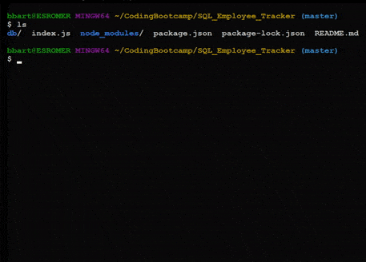

# SQL Employee Tracker

## README created by: MrBusiness87

---

## Table of Contents:

- [Title](#Title)
- [Description](#Description)
- [Installation](#Installation)
- [Usage](#Usage)
- [Questions](#Questions)

---

### Title:

SQL Employee Tracker

### Description:

[Screencastify Video LINK](https://drive.google.com/file/d/1AxPLo9gAZDjIqjkD-EtLOHyISK4ZLvlk/view)

This project deals with adding a employee, role, or department to a list and saving it for future use. You can also look up existing employees and change their roles through the prompt.

### Installation:

The command to install dependencies is: npm i mysql inquirer .
Upon downloading the repository, you will need to install your dependencies through your git bash. You will also need your own SQL password to be able to run schema.sql.

### Usage:

Keeping records in a small company where there are about 5 departments with less than 80 employees, including management.

---

### Questions:

- GitHub Page: https://github.com/MrBusiness87
- Please send an email to: bbartula87@gmail.com, with any Questions/Concerns/Comments!
